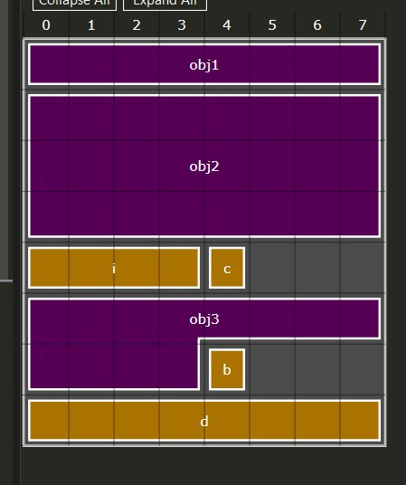
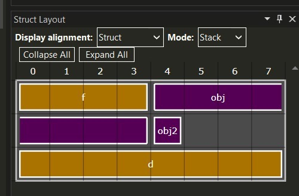

via github.com/stoychoX
# Структури

Пресметнете и проверете чрез оператора `sizeof` колко е големината на следните структури.
```c++
struct empty {
};

struct test1 {
	int number;
};

struct test2 {
	char symbol;
	int number;
};

struct test3 {
	char symbol;
	short sh;
	int number;
};

struct test4 {
	char symbol1;
	int number;
	char symbol2;
};

struct student {
	char* name;
	int* grades;
};

struct test5 {
	char a[5];
	int b;
	double c;
};

struct test6 {
	char a[3];
	short b;
	double c[4];
	char d;
};
```
```c++
struct A
{
	double c;
	char b; 
};

struct B
{
	char c;
};

struct C
{
	A obj;
	B obj2;
};
```
```c++
struct A
{
	double c;
	char b;
	int k;
	char s;
};

struct B
{
	int a;
	char c;
	char d;
	float f;
};

struct C
{
	char arr[3];
	float f;
};

struct D
{
	C obj1;
	A obj2;
	int i;
	char c;
	B obj3;
	bool b;
	double d;
};
```
На снимката е показано подравняването на горната структура `struct D`


```c++
struct A
{
	int a;
	char b;
};

struct B
{
	char c;
};

struct C
{
	char f;
	A obj;
	B obj2;
	double d;
};
```
На снимката е показано подравняването на горната структура `struct C`

