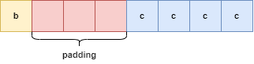
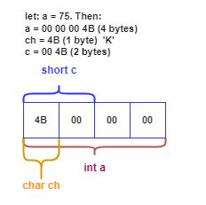
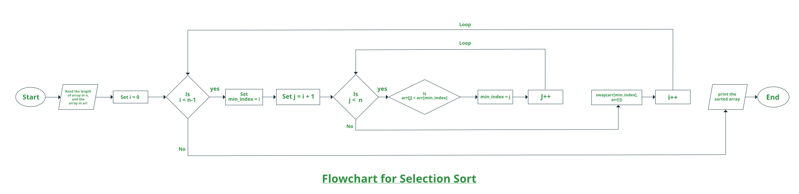

#  **Преговор на указатели, референции и динамична памет. Увод в ООП. Обекти. Структури и обединения**

- [Преговор. Указатели, референции, динамична памет.](https://github.com/Angeld55/Object-oriented_programming_FMI/blob/main/Sem.%2001/README.md#%D0%BF%D1%80%D0%B5%D0%B3%D0%BE%D0%B2%D0%BE%D1%80-%D1%83%D0%BA%D0%B0%D0%B7%D0%B0%D1%82%D0%B5%D0%BB%D0%B8-%D1%80%D0%B5%D1%84%D0%B5%D1%80%D0%B5%D0%BD%D1%86%D0%B8%D0%B8-%D0%B4%D0%B8%D0%BD%D0%B0%D0%BC%D0%B8%D1%87%D0%BD%D0%B0-%D0%BF%D0%B0%D0%BC%D0%B5%D1%82)
- [Обектно-ориентирано програмиране](https://github.com/Angeld55/Object-oriented_programming_FMI/blob/main/Sem.%2001/README.md#%D0%BE%D0%B1%D0%B5%D0%BA%D1%82%D0%BD%D0%BE-%D0%BE%D1%80%D0%B8%D0%B5%D0%BD%D1%82%D0%B8%D1%80%D0%B0%D0%BD%D0%BE-%D0%BF%D1%80%D0%BE%D0%B3%D1%80%D0%B0%D0%BC%D0%B8%D1%80%D0%B0%D0%BD%D0%B5)
- [Структури](https://github.com/Angeld55/Object-oriented_programming_FMI/blob/main/Sem.%2001/README.md#%D1%81%D1%82%D1%80%D1%83%D0%BA%D1%82%D1%83%D1%80%D0%B8)
- [Представяне в паметта и подравняване](https://github.com/Angeld55/Object-oriented_programming_FMI/blob/main/Sem.%2001/README.md#%D0%BF%D1%80%D0%B5%D0%B4%D1%81%D1%82%D0%B0%D0%B2%D1%8F%D0%BD%D0%B5-%D0%B2-%D0%BF%D0%B0%D0%BC%D0%B5%D1%82%D1%82%D0%B0-%D0%B8-%D0%BF%D0%BE%D0%B4%D1%80%D0%B0%D0%B2%D0%BD%D1%8F%D0%B2%D0%B0%D0%BD%D0%B5)
- [Обединения](https://github.com/Angeld55/Object-oriented_programming_FMI/blob/main/Sem.%2001/README.md#%D0%BE%D0%B1%D0%B5%D0%B4%D0%B8%D0%BD%D0%B5%D0%BD%D0%B8%D1%8F)
- [Енумерации](https://github.com/Angeld55/Object-oriented_programming_FMI/tree/main/Sem.%2001#%D0%B5%D0%BD%D1%83%D0%BC%D0%B5%D1%80%D0%B0%D1%86%D0%B8%D0%B8-enums)
- [Namespaces](https://github.com/Angeld55/Object-oriented_programming_FMI/blob/main/Sem.%2001/README.md#namespaces)
- [Задачи](https://github.com/Angeld55/Object-oriented_programming_FMI/blob/main/Sem.%2001/README.md#%D0%B7%D0%B0%D0%B4%D0%B0%D1%87%D0%B8)

##  **Преговор. Указатели, референции, динамична памет.**


Паметта, която можем да използваме в **C++** има 4 основни типа:
<br />

*	**Глобална (Статична)**: в тази памет се записват статичните/глобалните променливи.
*	**Стекова (stack)**: тя съдържа "локалните" променливи, т.е. онези, които са дефинирани в телата на функции и са същевременно нестатични.
	  * Заделя се в момента на дефиниция на променливите и се освобождава в момента на изход от scope-a, в която е дефинирана;
	  * Последно заделената памет се освобождава първа (First in Last out);
	  * Количеството заделена памет е определена по време на компилация;
	  * Ние нямаме контрол над управлението над паметта
*	**Динамична (heap)**: е "свободната" част от паметта, която се използва (<em>динамично</em>) в хода на програмата. 
	* Заделя се и се освобождава по всяко време на изпълнение на програмата;
	* Областта за динамична памет е набор от свободни блокове памет;
	* Програмата може да заяви блок с произволна големина;
	* Имаме контрол над управлението на паметта;	  
*	**Program Code**: памет, в която се пази нашият компилиран код
	* Може да се достъпва с function pointer-и

### **Създаване на променливи (в статичната и динамичната памет)**
 ```c++
int main()
{
	int a = 10; // int in the stack
	int* ptr = new int(30); // int in the dyniamic memory
                            // we use a pointer on the stack to point to the int

	// print the value of the int in the stack and the one in the heap
	std::cout << "First number: " << a << " " << " second number: " << (*ptr) << std::endl;
	
	// ptr holds an address in the dynamic memory where the int is placed
	std::cout << "Address of second number" << ptr << std::endl;
	
	delete ptr; // delete the int in the stack to prevent memory leak
	
	ptr = &a;   // redirect the pointer to int in the stack
	std::cout << "Address of first number" << ptr << std::endl; // now ptr holds the address that is in the stack
	
	int& b = a; // creates int which data is on the address of a => they share the same memory
	b = 30;
	
	std::cout << "First number" << a << std::endl // 30
}
 ```

### **Подаване на параметри във функция**

#### **Подаване по копие.**

 ```c++
#include <iostream>

void f(int a)
{
	a++; // a++ will increment the value of the copy
}

int main()
{
	int a = 10;
	f(a);
	std::cout << a << std::endl; //10
}
 ```
#### **Подаване по референция.**

 ```c++
 #include <iostream>
 
void f(int& a)
{
	a++; // a++ will increment the actual value of the passed variable
}

int main()
{
	int a = 10;
	f(a);
	std::cout << a << std::endl; //11
}
 ```
#### **Подаване по указател.**

 ```c++
#include <iostream>

void f(int* a)
{
	(*a)++; // a++ will increment the value at the address where the pointer points at
}

int main()
{
	int a = 10;
	f(&a); // &a gives us the address of a which can be assigned to a pointer variable
	std::cout << a << std::endl; //11
}
 ```
 
## **Обектно-ориентирано програмиране**
Програмна парадигма -  представлява фундаменталния стил на програмиране. <br />

Обектно-ориентирано програмиране е **програмна парадигма**, при която една програмна система се моделира като набор от обекти, които взаимодействат помежду си, за разлика от традиционното виждане, в което една програма е списък от инструкции, които компютърът изпълнява. Всеки обект е способен да получава съобщения, обработва данни и праща съобщения на други обекти.

### **Принципи:**
- Абстракция
  - процесът на скриване на ненужни подробности от потребителя
- Капсулация
  - един обект трябва да предоставя на ползващия го само пряко необходимите му средства за управление.
- Наследяване
  - позволява да бъдат дефинирани и създавани обекти, които са специализирани варианти на вече съществуващи обекти.
  - класът наследник взема всички свойства и методи на класа-родител
- Полиморфизъм
  - представлява свойството на обектите от един и същи тип да имат един и същи интерфейс, но с различна реализация на този интерфейс.

**Техническият дълг** е концепция в програмирането, която отразява допълнителната разработка, която възниква, когато се използва лесен за изпълнение код в краткосрочен план, вместо да се прилага най-доброто цялостно решение. <br/>

##  [**Структури**](https://en.cppreference.com/w/c/language/struct)

Структурите в C++ се използват за групиране на елементи. Елементите, наричани още членове, могат да бъдат от различен тип и с различна дължина.

```c++
struct Box
{
	double height;
	double width;
	double length;
	// double height, width, length; is also possible
}
 ```

###  **Деклариране на обекти от новия тип**
 ```c++
Box b; // default values to height and width and length

Box b2 = {3, 4, 3.4} // height = 3, width = 3, length = 3.4;

Box b3;
b3.height = 13;
b3.width = 14;
b3.lenght = 20;
 ```
	
#### **Подаване във функции**
Ако няма да променяме обекта го подаваме по **константна референция.**
 ```c++
double calculcateVolume(const Box& b)
{
    return b.height * b.width * b.length;
}
```
Може и само по **референция**, но тогава може да се правят промени върху подадения аргумент. 
   
 ```c++
void readBox(Box& b)
{
    cin >> b.height >> b.width >> b.length;
}
 ```
Може и да го подаваме по **копие**.
 ```c++
Box revertBox(Box b)
{
    int temp = b.height;
    b.height = b.width;
    b.width = temp;

    return b;
}
```
#### **Създаване на динамични обекти**
 ```c++
#include <iostream>

struct Box
{
	double height;
	double width;
	double length;
};

double calculcateVolume(const Box& b)
{
    return b.height * b.width * b.length;
}

int main()
{
	Box* boxPtr = new Box();

	// different types of assigning a value to a property when you have a pointer
	(*boxPtr).height = 3;
	(*boxPtr).width = 1;
	boxPtr->length = 4;
	
	std::cout << calculcateVolume(*boxPtr) << std::endl;
	
	delete boxPtr;
}
```

#### **Влагане на обекти**
 ```c++
struct Box
{
	double height;
	double width;
	double length;
};

struct Warehouse
{
	char name[1024];
	Box b1;
	Box b2;
};

int main()
{
	Warehouse w = { "Ekont", { 1, 2, 3 }, { 4, 5, 3 } };

	std::cout << w.name;
}
```

#### **Масиви от обекти**
 ```c++
struct Box
{
	double height;
	double width;
	double length;
};

int main()
{
	Box arr1[30]; // 30 boxes
	Box* arr2 = new Box[20] // 20 boxes in dynamic mem.
	
	std::cout << arr1[0].height << " " << arr2[3].width << std::endl;

	delete[] arr2;
}
```
## **Представяне в паметта и подравняване.**

*	Паметта е байт-адресируема, т.е. може да достъпва всеки байт индивидуално;
*	Колко памет може да прочете процесорът за един memory read cycle-a зависи от архектурата му (x32 - 4 bytes, x64 - 8 bytes);
*	В паметта променливите са разположени в същия ред, в който са декларирани в структурата;
*	Подравняването на една структура става по **големината на най-голямата член-данна (даже и в случая на вложена структура)** на структурата (с цел минимизация на подравняването);
*	За да бъде минимална паметта, която ползва една структура, трябва да подредим нейните член-данни в нарастващ или намаляващ ред по големина на променливата

```c++
struct Example1
{
    bool b;         // 1 byte
    int c;	    // 4 bytes
} ex1;

struct Example2
{
    short int s;    //2 bytes
    char c;         //1 byte
    int i;          //4 bytes
} ex2;

// How can the following struct use less memory?
struct Example3
{
    char c;         //1 byte
    double d;       //8 bytes
    int s;          //4 bytes
} ex3;

// the padding is equal to the biggest variable, if it is an int => 4 bytes
std::cout << sizeof(ex1) << std::endl; // 8
std::cout << sizeof(ex2) << std::endl; // 8
std::cout << sizeof(ex3) << std::endl; // 24
```
<i>Представяне на ExampleA в паметта:</i> <br />


## [**Обединения**](https://en.cppreference.com/w/cpp/language/union)
Обединенията са част от паметта, която се поделя при съхранение на две или повече променливи. <br />
Променливите, поделящи паметта могат да са от различни типове.<br />
Във всеки един момент обаче може да се ползва само една променлива от състава на обединението.<br />

Използва едно и също място в паметта за всеки от своите членове.

```c++
union Example
{
	int a;
	char b;
} var;

int main()
{
	var.a = 65;
	std::cout << var.a << " " << var.b; // 65 A
}
```

```c++
union Example
{
	int a;
	char b;
	double c;
	float d;
};

int main()
{
	std::cout << sizeof(union Example); //8
}
```

```c++
union Example
{
	int a;
	char b;
} var;

int main()
{
	var.a = 90;
	union Example *p = &var;
	std::cout << p->a << " " << p->b; //90 Z
}
```


## [Енумерации (Enums)](https://en.cppreference.com/w/cpp/language/enum)
Eнумерацията е отделен тип, чиято стойност е ограничена до диапазон от стойности, който може да включва няколко изрично посочени константи(енумератори). Стойностите на константите са стойности от интегрален тип, известен като основен тип на eнумерацията Eнумерацията има същия размер, представяне на стойност и изисквания за подравняване като неговия основен тип. Освен това всяка стойност на енумерацията има същото представяне като съответната стойност на основния тип. <br />

```c++
enum <name>
{
	<element>, //0
	<element>, //1
	.
	.
	.
};

enum IceCream1
{
	vanilla, //0
	chocolate, //1
	strawberry, //2
	mango, //3
	oreo //4
};

enum IceCream2 : char
{
	vanilla, //0
	chocolate, //1
	strawberry, //2
	mango, //3
	oreo //4
};
```

### Unscoped enumarations (plain enums) vs Scoped enumarations (enum class | struct)
```c++
enum class Color { red, green, blue }; // enum class
enum Animal { dog, cat, bird, human }; // plain enum 
```

- enum classes
  - енумераторите са локални за enuma и техните стойности не се преобразуват имплицитно към други типове (another enum or int).
- Plain enums
  - енумераторите са в същия scope като enuma и техните стойности се преобразуват имплицитно към integers и други типове.

```c++
enum Color { red, green, blue };                    // plain enum 
enum Card { red_card, green_card, yellow_card };    // another plain enum 
enum class Animal { dog, deer, cat, bird, human };  // enum class
enum class Mammal { kangaroo, deer, human };        // another enum class

void fun() {
    // examples of bad use of plain enums:
    Color color = Color::red;
    Card card = Card::green_card;

    int num = color;    // no problem

    if (color == Card::red_card) // no problem (bad)
        cout << "bad" << endl;

    if (card == Color::green)   // no problem (bad)
        cout << "bad" << endl;

    // examples of good use of enum classes (safe)
    Animal a = Animal::deer;
    Mammal m = Mammal::deer;

    int num2 = a;   // error
    if (m == a)     // error (good)
        cout << "bad" << endl;

    if (a == Mammal::deer) // error (good)
        cout << "bad" << endl;
}
```

Извод: enum class | struct трябва да се предпочитат, защото причиняват по-малко изненади, които потенциално биха могли да доведат до грешки.

## [Namespaces](https://en.cppreference.com/w/cpp/language/namespace)
Пространствата от имена предоставят метод за предотвратяване на конфликти с имена. <br />
Символите, декларирани вътре в namespace block, се поставят в наименуван scope, който не позволява да бъдат сбъркани със символи с идентични имена в други диапазони. <br />

```c++
namespace A
{
    int i;
}
 
namespace B
{
    int i;
    int j;
 
    namespace C
    {
        namespace D
        {
            using namespace A; // all names from A injected into global namespace
 
            int j;
            int k;
            int a = i;         // i is B::i, because A::i is hidden by B::i
        }
 
        using namespace D; // names from D are injected into C
                           // names from A are injected into global namespace
 
        int k = 89; // OK to declare name identical to one introduced by a using
        int l = k;  // ambiguous: C::k or D::k
        int m = i;  // ok: B::i hides A::i
        int n = j;  // ok: D::j hides B::j
    }
}

namespace Q
{
    namespace V   	// V is a member of Q, and is fully defined within Q
    { 			 	// namespace Q::V // C++17 alternative to the lines above
        class C		// C is a member of V and is fully defined within V
		{ 
			 void m(); // C::m is only declared
		};
        void f(); // f is a member of V, but is only declared here
    }
 
    void V::C::m() // definition of V::C::m outside of the namespace (and the class body)
    {}             // enclosing namespaces are the global namespace, Q, and Q::V
}
```

## **Задачи**

**Задача 1:** Въвежда се цяло число **N**  и после **N** тригъгълника в равнината, определени от 3 точки ( 6 координати). <br />
Отпечатайте тригълниците **сортирани по лицата им.**


**Задача 2:** Резлизирайте структура Rational, която е за работа с рационални числа. <br />
Имплементирайте функции за събиране, изваждане, умножение и деление. <br />
Имеплементирайте функция, която приема истанция(обект) от новия тип и връща дали е валидно рационално число, както и функция, която връща дали е цяло число. <br />
