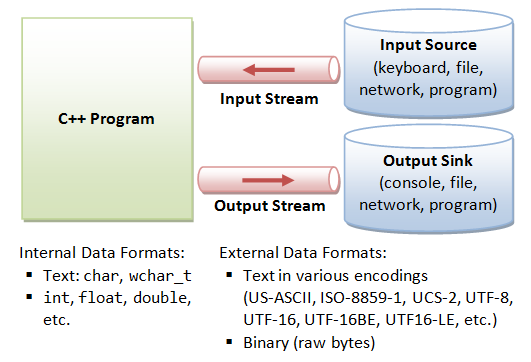
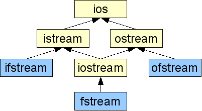

##  Потоци и Файлове (част 1). Текстови файлове.
### Видове потоци ###
Поток (stream) - последователност от байтове данни влизащи в и излизащи от програмата.
* При операциите за вход, байтовете идват от източник за вход (клавиатура, файл, мрежа или друга програма)
* При операциите за изход, байтовете данни излизат от програмата и се "вливат" във външно "устройство" (конзола, файл, мрежа или друга програма)
* Потоците служат като посредници между програмите и самите IO устройства по начин, който освобождава програмиста от боравене с тях.
* Потокът дефинира интерфейс с операции върху него, които не зависят от избора на IO устройство

    
  За да извърши вход или изход, една C++ програма:
  * Създава поток;
  * Свързва потока с IO устройството (напр. конзола, клавиатура, файл, мрежа или друга програма);
  * Извършва операции за вход/изход върху потока;
  * Прекъсва връзка с потока;
  * Освобождава потока;    
  
Видове потоци:
 - Потоци за вход ([istream](https://en.cppreference.com/w/cpp/io/basic_istream)).
 - Потоци за изход ([ostream](https://en.cppreference.com/w/cpp/io/basic_ostream)).
 


#####  Пример за работа с вход от конзолата. [cin](https://en.cppreference.com/w/cpp/io/cin) (обект от тип istream).
 ```c++
#include <iostream>

int main()
{
	int a, b;
	std::cin >> a >> b; // read two integers from the console input stream
}
 ```
 Четем от стандартния вход.

#####  Пример за работа с поток за изход. [cout](https://en.cppreference.com/w/cpp/io/cout) (обект от тип ostream).
 ```c++
#include <iostream>

int main()
{
	int a = 10;
	int b = 12;
	int c = a + b;

	std::cout << a << " + " << b << " = " << c << std::endl; // write two integers in the console output stream
}
 ```
	
### Работа с поток за вход от файл ([ifstream](https://en.cppreference.com/w/cpp/io/basic_ifstream))
Пример за четене от файл!
 ```c++
#include <iostream>
#include <fstream>

const char FILE_NAME[] = "myFile.txt";

int main()
{
	std::ifstream file(FILE_NAME); // create input file stream associated with myFile.txt

	if (!file.is_open()) {
		std::cout << "Error!" << std::endl;
		return -1;
	}
	
	int a, b;
	file >> a >> b;

	file.close();
}
```
Пример за прочитане на цялото съдържание файл:
 ```c++
#include <iostream>
#include <fstream>

const int BUFF_SIZE = 1024;
const char FILE_NAME[] = "myFile.txt";

int main()
{
	std::ifstream file(FILE_NAME);

	if (!file.is_open()) {
		std::cout << "Error!" << std::endl;
		return -1;
	}
	
	while (!file.eof()) {
		char buff[BUFF_SIZE];
		file.getline(buff, BUFF_SIZE);
		
		//do something with the line
		std::cout << buff << std::endl;
	}
	
	file.close();
}
```
### Работа с поток за изход към файл ([ofstream](https://en.cppreference.com/w/cpp/io/basic_ofstream))
   
 ```c++
#include <iostream>
#include <fstream>

const char FILE_NAME[] = "myFile.txt";

int main()
{
	std::ofstream file(FILE_NAME);  // create output file stream associated with myFile.txt

	if (!file.is_open()) {
		std::cout << "Error!" << std::endl;
		return -1;
	}
	
	int a = 3;
	int b = 10;

	file << a << " " << b << " " << a + b << std::endl; // write into the output file stream
	
	if(!file.eof()) { //check if the file has ended
		std::cout << "The file contains more data after the two integers!" << std::endl;
	}

	file.close();
}
 ```

 - (istream) [get](https://en.cppreference.com/w/cpp/io/basic_istream/get) - функция, която чете следващия character в потока. 
 - (ostream) [put](https://en.cppreference.com/w/cpp/io/basic_ostream/put) - функция, която поставя на следваща позиция character в потока.
 - ifstream или istream - съдържа get указател, който реферира елемента, който ще се прочете при следващата входна операция.
 - ofstream или ostream - съдържа put указател, който реферира мястото, където ще се запише следващият елемент.
 - put и get не са [форматирани](https://www.geeksforgeeks.org/unformatted-input-output-operations-in-cpp/) за разлика от operator<< и operator>>, тоест не пропускат whitespaces и др.

### Позициониране във файл

 - tellg() - Връща позицития на текущия символ в **потока за четене**
 - tellp() - Връща позицития на текущия символ в **потока за писане**
 - seekg(offset, direction) - Премества get-указателят на позцития на **потока за четене**.
 - seekg(streampos idx) - Премества get-указателят на позция idx на **потока за четене**.
 - seekp(offset, direction) - Премества put-указателят на позцития на **потока за писане**.
 - seekp(streampos idx) - Премества put-указателят на позция idx на **потока за писане**.

-**offset** : целочислена стойност. Отместването от direction.
 
 -**direction** : Може да заема следите стойностти:

1. ios::beg - началото на файла.
2. ios::cur - текущата позиция във файла.
3. ios::end - края на файла.

### [Режими на работа](https://en.cppreference.com/w/cpp/io/ios_base/openmode)

 ```c++
	ifstream str("file.txt", <режим на работа>).
 ```
Режимът на работа е цяло число. Ако искаме да зададем повече от един ги изреждаме с двоично или('|').

| ios         | Ефект:                                                                                                                           |    |
|-------------|----------------------------------------------------------------------------------------------------------------------------------|----|
| ios::in     | Отваря файл за извличане.                                                                                                        | 1  |
| ios::out    | Отваряне на файл за вмъкване. Допуска се вмъкване на произволни места във файла. Ако файлът съществува, съдържанието се изтрива. | 2  |
| ios::ate    | Отваря за вмъкване и установява указателя put в края на файла. Допуска вмъкване на произволни места.                             | 4  |
| ios::app    | Отваря за вмъкване и установява указателя put в края на файла                                                                    | 8  |
| ios::trunc  | Ако файлът съществува, съдържанието се изтрива.                                                                                  | 16 |
| ios::binary | Превключва режима от текстов в двоичен                                                                                           | 32 |
|ios::_Nocreate | Отваря за вмъкване, само ако файлът с указаното име съществува.| 64 |
|ios::_Noreplace | Отваря за вмъкване само ако файлът с указаното име не съществува.| 128 |
 

 ```c++
	ofstream file("file.txt", ios::out | ios::app).
 ```
 
### [Флагове на състоянията на потока](https://en.cppreference.com/w/cpp/io/ios_base/iostate)
| Флаг:| Значение:                                                                      | 
|--------|------------------------------------------------------------------------------|
|bad()   | Има загуба на информация. Някоя операция за четене и писане не е изпълнена. |
|fail() |Последната входно/изходна операция е невалидна.|
|good() | Всички операции са изпълнени успешно.|
|clear()| Изчиства състоянието на потока (Вече good() ще върне истина).|
| [eof()](https://en.cppreference.com/w/cpp/io/basic_ios/eof) | Достигнат е края на файла. |

   


 ##  Задачи
 
**Задача 1**: Напишете програма, която отпечатва собствения си код.

**Задача 2**: Напишете функция, която приема име на съществуващ файл и име връща броя на редовете в него.

**Задача 3**: Напишете функция, която приема име на съществуващ файл и име и копира съдържанието на същестуващия файл в нов файл.

**Задача 4**: Напишете функция, която приема имената на два текстови файла, в които са записани цели числа в сортиран вид. Числата са разделени с интервал.
Запишете в нов файл числата от двата дайла в сортиран вид. Числата отново да са разделени с интервал.

**Задача 5**: Напишете функции, които запазват и четат масив от студенти в текстов файл.

**Задача 6**: Напишете програма,  която чете comma-separated values (**CSV**) файл със студенти **със следните 4 полета**: Първо име, Фамилно име, Стринг на факултетен номер, Имейл
1.  Със стартирането на програмата потребителят да въвежда име на файл, който да бъде зареден в паметта.
2.  Напишете функция, която след зареждане на файла да отпечатва на **стандартния изход** информация за студента при подаден **факултетен номер**.
3.  Напишете функция, която **по подаден факултетен номер, специалност и низ**, променя email-a на студента, който има дадения факултетен номер и учи подадената специалност, с подадения низ.
4.  Напишете функцията , която приема низ (име на файл) и запазва студентите в същия формат (**CSV**). Т.е. при повторно пускане на програмата да може да прочете новия генериран файл.

! Студентите имат уникални факултетни номера, в рамките на една специалност !

Да се реализира прост интерфейс, с който да се извикват написаните фунцкии през конзолата:

**Пример** (входът от потребителя започва с '>'):

 ```
Open file: 
>students.csv
File successfully opened!
>print 123 ComputerScience
Name = Stefan Velkov, Speciality: Computer science Email: stefan@yahoo.com, FN: 123
>edit 123 ComputerScience stecho@abv.bg
>print 123 ComputerScience
Name = Stefan Velkov, Email: stecho@abv.bg, FN: 123
>save students2.csv
file students2.csv successfully saved!
```

